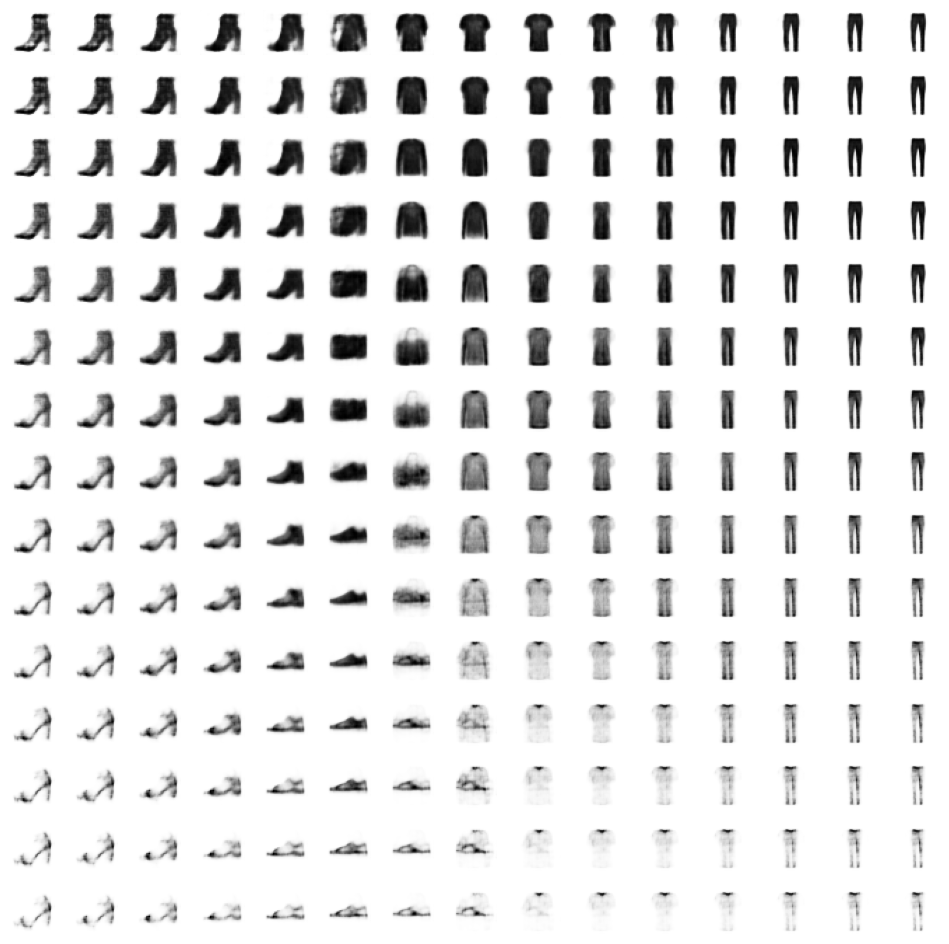
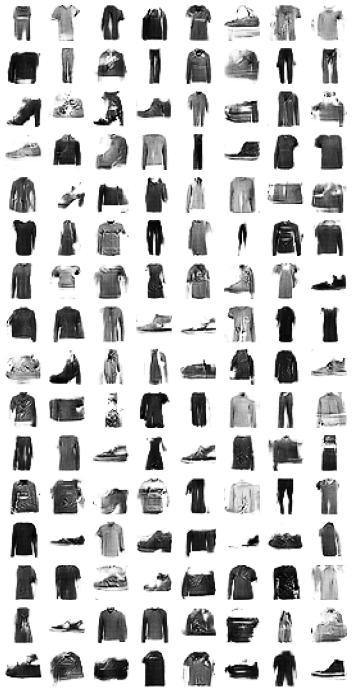

# Study materials of various generative image models

## Auto Encoder

## Auto Encoder based on GRU

## Denoising with Auto Encoder

## Deep Convolutional VAE ( Variational Auto Encoder )

## Deep Convolutional GAN ( Generative Adversarial Nets )

