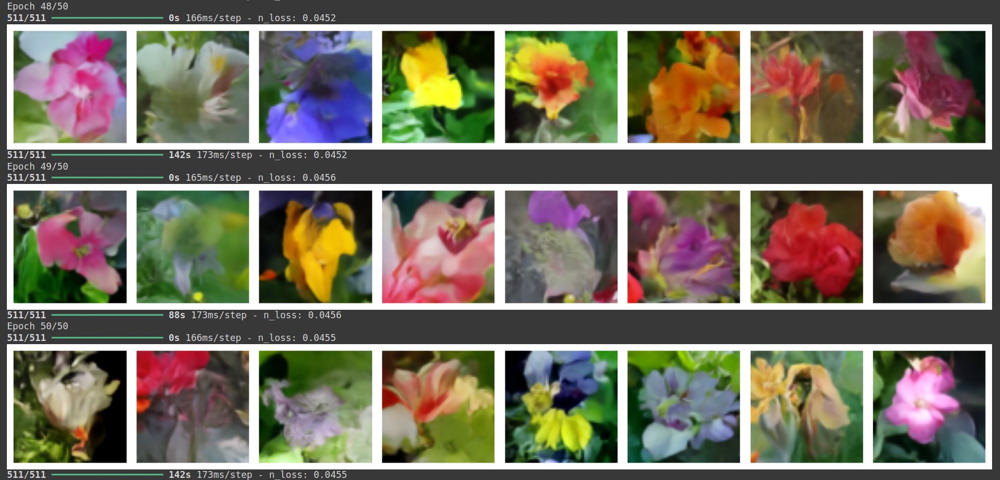

Study materials of various generative image models
=====

# :shirt: Image Generation

## Auto Encoder

## Auto Encoder based on GRU

## Denoising with Auto Encoder

## Deep Convolutional VAE ( Variational Auto Encoder )

## Deep Convolutional GAN ( Generative Adversarial Nets )

## Denoising Diffusion Model

### Image Interpolation with 2 initial gausian noises

# :memo: Text Generation

## Recurrent Neural Network ( LSTM, GRU, Bidirectional )

<a href="./text-generation/docs/text-generation-with-rnn.pdf" target="_blank">Details how RNN constructs Texts</a>

## Recurrent Neural Network with Attention

